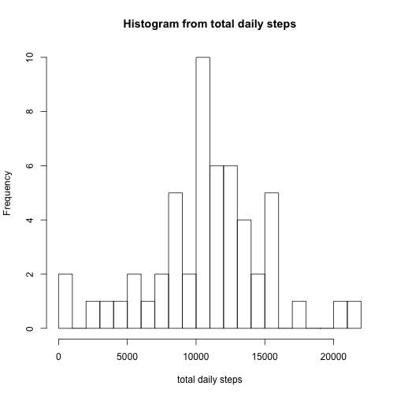
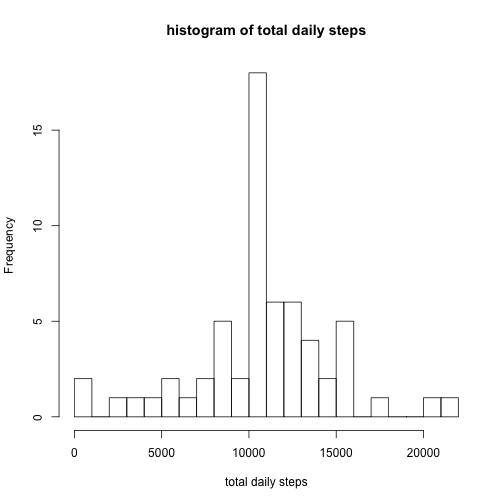
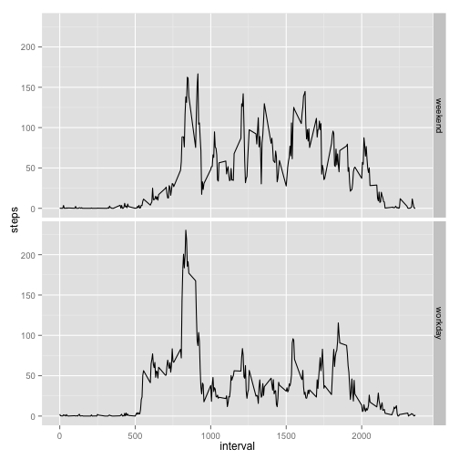

```r
knitr::opts_chunk$set(echo=TRUE,warning=FALSE, message=FALSE)
```


## Loading and Processing Data

The following code loads and processes the data.  There is no output at this point.  We omit NA values and load necessary libraries.


```r
activity <- read.csv("activity.csv")
activity1 <- na.omit(activity)
library("plyr")
library("ggplot2")
```

## Steps Per Day

For each day, we consider the total number of steps taken.  The output is a histogram (where steps fall into buckets of thousands) as well as the mean and median of daily steps.


```r
totalDailySteps <- ddply(activity1,.(date),colwise(sum))
totalDailySteps <- totalDailySteps[,c(1,2)]
hist(totalDailySteps$steps, breaks = 25,xlab = "total daily steps",main = "Histogram from total daily steps")
```

 

```r
mean(totalDailySteps$steps)
```

```
## [1] 10766.19
```

```r
median(totalDailySteps$steps)
```

```
## [1] 10765
```

## Steps Per Time Interval

For each five minute interval in the day, we consider the average number of steps taken.  We create a time-series plot of this data.  We also output the time interval with the maximum average number of steps.


```r
AvgStepsPerInterval <- ddply(activity1,.(interval),colwise(mean))
AvgStepsPerInterval <- AvgStepsPerInterval[,c(1,2)]
plot(AvgStepsPerInterval, type = 'l')
```

 

```r
AvgStepsPerInterval[which.max(AvgStepsPerInterval$steps),][,1]
```

```
## [1] 835
```

## Replacing Missing Values

Here we replace all NA values by the average number of steps during the associated time interval.  The code merges two dataframes and rearranges columns to put it in the exact format as the original data.  We then output a histogram on total steps per day, the average number of steps per day, and the median number of steps per day.  We notice that replacing missing values changes the data, but only slightly.


```r
activity2 <- merge(activity,AvgStepsPerInterval,by = c("interval"),all.x = TRUE)
colnames(activity2) = c("interval","steps","date","avgsteps")
activity2[is.na(activity2$steps),2] <- activity2[is.na(activity2$steps),4]
activity2 <- activity2[,c(2,3,1)]
activity2 <- activity2[order(activity2$date,activity2$interval),]
totalDailySteps2 <- ddply(activity2,.(date),colwise(sum))
hist(totalDailySteps2$steps, breaks = 25,xlab = "total daily steps",main = "histogram of total daily steps")
```

 

```r
mean(totalDailySteps2$steps)
```

```
## [1] 10766.19
```

```r
median(totalDailySteps2$steps)
```

```
## [1] 10766.19
```

## Workdays and Weekends

The following code distinguishes the days as either weekdays or weekends.  The output is a paneled time series plot of the average number of steps taken during each interval, grouped by workday or weekend.


```r
activity2["weekday"] <- factor(weekdays(as.Date(activity2$date)))
activity2["workday"] <- factor(ifelse(activity2$weekday %in% c("Saturday","Sunday"),'weekend','workday'))
compareWeekend <- ddply(activity2,.(interval,workday),colwise(mean))
compareWeekend <- compareWeekend[,1:3]
qplot(interval,steps,data=compareWeekend,facets = workday~.,geom="line")
```

 

